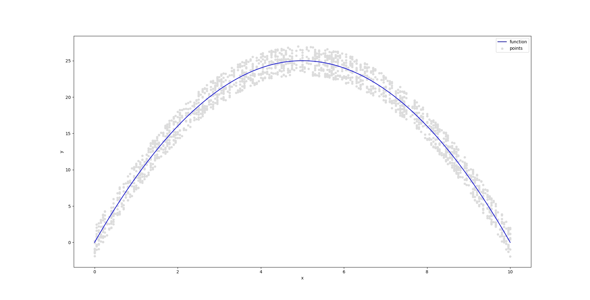

# Chapter 1 - Introduction

- predicting a **continuous or quantitative** output value is often referred to as a **regression** problem
- predicting a **non-numerical (categorical) or qualitative**  value is referred to as a **classification** problem
- **principal components** *summarise* the number of features for each record to a few numbers or **dimensions**

## Notation

- $n$ is the number of observations

- $p$ number of variables (features+labels)

if $i=1,2,\dots,n$ and $j =1,2,\dots,n$ , $x_{ij}$ represents the value of the $j^{th}$ observation for the $i^{th}$ variable. Hence
$$
\bold{X}= 
\begin{pmatrix}
x_{11} & x_{12} & \dots & x_{1p}\\
x_{21} & x_{22} & \dots & x_{2p}\\
\vdots & \vdots & \ddots & \vdots\\
x_{n1} & x_{n2} & \dots & x_{np}\\
\end{pmatrix}
$$
$\bold{X}$ can be written as
$$
\bold{X} =
\begin{pmatrix}
x_1 & x_2 & \dots & x_p
\end{pmatrix}
$$
or
$$
\bold{X} =
\begin{pmatrix}
x_1^T \\
x_2^T \\
\vdots\\
x_n^T
\end{pmatrix}
$$

# Chapter 2

## Chapter2.1 Introduction to Regression Models

Consider an example

$sales=f(Tv, radio, newspaper)$

where sales is a function of newspaper. tv and radio ads

- sales is a **response** or **target**, $Y$
- tv, radio and newspaper are **features**, **inputs** or **predictors** $X_1, X_2, X_3$ respectively

$$
X =
\begin{pmatrix}
X_1\\
X_2\\
X_3
\end{pmatrix}
$$

$$
Y=f(X) + \epsilon
$$

where $\epsilon$ is the measurement error

with $f(X)$ we can

- make predictions
- understand which components are important
- might understand how each $X_j \in X$ affects $Y$

finding the ideal $f(x)$ say at $x=4$ a good value would be 

$$
f(4)= E(Y|X=4)
$$

that is the expected value is the average of the values of $Y$ for all the observations with $X=4$.

So the **regression** problem is to find the best $f(x)$ for a given $x$

$$
f(x) = E(Y|X=x)
$$

for a vector $X$

$$
f(x) = f(x_1, x_2, \dots, x_p) = E(Y|X_1=x_1, X_2=x_2, \dots, X_p=x_p)
$$

where $E(Y|X=x)$ is the expected value of $Y$ for all the observations with $X=x$, that minimizes the squared error, therefore

$f(x) = E(Y|X=x)$ is the function that minimizes

$$
E[(Y-g(X))^2 | X=x], \forall g \forall x
$$

the irreducible error is the error that cannot be reduced to a smaller error

$$
\epsilon = Y - f(X)
$$

hence for any estimate

$$
E[(Y-\hat{f}(X))^2 | X=x] = [f(X)- \hat{f}(X)]^2 + Var(\epsilon)
$$

where

- $Var(\epsilon)$ is the reducible error
- $[f(X)- \hat{f}(X)]^2$ is the irreducible error

**irreducible error** is the variance of the errors

